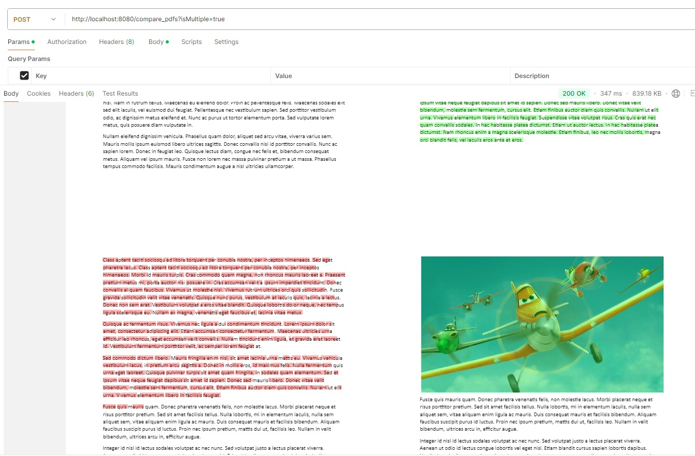

# pdf-compare



```shell
#isMultiple: true/false

curl --location 'http://localhost:8080/compare_pdfs?isMultiple=false' \
--form 'pdf1=@"/C:/Users/user/Downloads/lipsum3.pdf"' \
--form 'pdf2=@"/C:/Users/user/Downloads/lipsum4.pdf"'

```